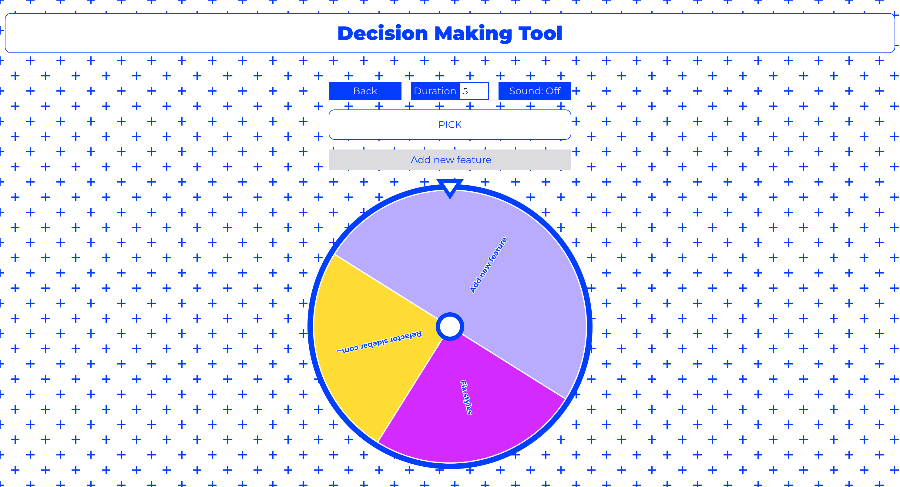

# Decision-Making Tool

**Decision-Making Tool** is a single-page application that allows users to create a list of options and make randomized selections from it. It involves creating, modifying, and deleting HTML elements dynamically using code. The application features navigation using the Hash routing and preserves user input across sessions via the Web Storage API. The application supports saving data to downloadable files, as well as loading and processing user-provided files. Data is visualized through custom canvas-based rendering, animated using requestAnimationFrame and the Animations API. The project is built with a strict focus on clean code, modular architecture, and modern configuration practices.

**Rolling Scopes School Task** — Stage 2: [Decision-Making Tool](https://github.com/rolling-scopes-school/tasks/blob/master/stage2/tasks/decision-making-tool/README.md)

## Demo



## Local Setup

   ```bash
   git clone https://github.com/asfound/decision-making-tool.git
   npm instal
   npm run dev
